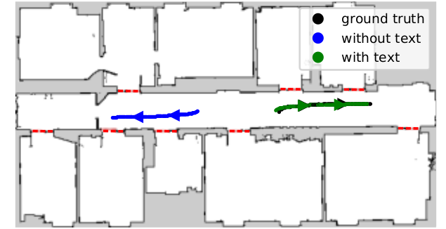
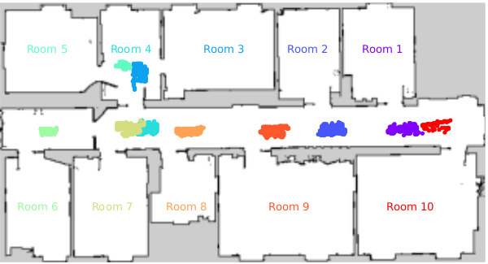

# 300 Sparticles - Robust Onboard Localization in Changing Environment Exploiting Text Spotting
This repository contains the implementation of the following publication:  
```bibtex
@article{zimmerman2022iros,
  author = {Zimmerman, Nicky and Wiesmann, Louis and Guadagnino, Tiziano and Läbe, Thomas and Behley, Jens and Stachniss, Cyrill},
  title = {{Robust Onboard Localization in Changing Environments Exploiting Text Spotting}},
  journal = iros,
  year = {2022}
}
```
## Overview



The standard MCL approach fails when the observations does not match the map dues to changes in the environment, especially in cases with high geometric symmetry. Using textual cues imporves global localization, and provides robust results even with only 300 particles. 



In our approach, we integrate textual information into a MCL framework. The text likelihood map, based on the collected data, indicate the locations in which detection of each room number is likely. The likelihood maps are used for particle injection when a
detection of a known text cues occurs. 

## Installation

Requirements:
* ROS 1 - Noetic
* OpenCV 4.5 
* Eigen
* GTest
* [JSON parser](https://github.com/nlohmann/json)
* Packages - map_server, amcl, gmapping

To save you some pain, please follow to OpenCV installation instructions in this [link](https://docs.opencv.org/4.x/d7/d9f/tutorial_linux_install.html). To integrate OpenCV 4.5 to ROS, you must download [vision_opencv](https://github.com/ros-perception/vision_opencv) to the ros1_ws/src folder. 

Required installations
```bash
sudo apt-get install nlohmann-json3-dev
sudo apt-get install libgtest-dev
sudo apt install libeigen3-dev
sudo apt-get install ros-noetic-gmapping
sudo apt-get install ros-noetic-amcl
sudo apt-get install ros-noetic-map-server
sudo apt-get install git-lfs
```

First you need to build the ncore library since I don't have a global CMake yet. Tough life. <br/>
```bash
cd ncore
mkdir build
cd build
cmake .. -DBUILD_TESTING=1 
make
```
To get the input files for the tests, you need to install git-lfs and execute
```bash
git lfs pull
```
To see everything is built correctly, you can run from the build directory
```bash
./bin/NMCLUnitTests
```
Then, in the ros1_ws, you have good old catkin so build with catkin_make. 
```bash
cd ros1_ws
catkin_make
source devel/setup.bash
```
If you encounter errors related to OpenCV versions, you can check [this](Docs/vision_opencv Issues.md).
For the text spotting models, you need to download these 3 files
* [crnn_cs.onnx](https://drive.google.com/uc?export=dowload&id=12diBsVJrS9ZEl6BNUiRp9s0xPALBS7kt)
* [alphabet_94.txt](https://drive.google.com/uc?export=dowload&id=1oKXxXKusquimp7XY1mFvj9nwLzldVgBR)
* [DB_IC15_resnet18.onnx](https://drive.google.com/uc?export=dowload&id=1vY_KsDZZZb_svd5RT6pjyI8BS1nPbBSX)

The project is structured as follows:
* ncore - C++ core libraries for sensors, localization and mapping, based on OpenCV and Eigen
* ros1_ws
    * nmcl_ros - ROS1 wrappers for integrating ncore with ROS1
More about the system design can be found [here](Docs/Architecture.md).


## Running the Algo

ConfigNMCLNode is the ROS1 wrappers that listens to relevant topics and broadcasts Pose messages with the pose prediction.  <br/>
To see the predictions and baseline (amcl) together in RVIZ, run
```bash
roslaunch nmcl_ros confignmcl.launch dataFolder:="path/to/data/folder/"
```

The data folder should have the following items:
* nmcl.config - specifies the localization algorithm 
* floor.config - defines where the floor resources are, and which map is used
* editor.xml - includes semantic information added via Maphisto
* textspotting.config - specifies algorithm parameters and resources
* YouBotMapRoomSeg.png - encodes the room segmentation
* YouBotMap.yaml - map metadata from gmapping)
* YouBotMap.pgm - map from gmapping)
* optitrack.yaml - defines the transformation between the optitrack frame and the map frame (optional)
<br/>
If you don't stick to this structure and naming, nothing will work. I didn't feel like putting to much effort on parsing and stuff. For an example of the content of these files, you can check out [this](nmcl/tst/data/floor/2021_10_27). The data folder contains mostly things that are environment specific, like maps and algorithms definitions.
<br/>
In addition, there is a configuration folder for sensors configuration. This includes:

* front_laser.config
* rear_laser.config
* cam0.config 
* cam1.config
* ...

The folder in which they are stored in also configurable through the launch files, but their names are hardcoded for now. An example of the format of the calibration file can be found in [here](nmcl/tst/data/config/front_laser.config).

### ConfigNMCLNode
Requires as input 3 topics, LaserScan from the front lidar, LaserScan from the rear lidar, Odometry from VO or Odometry from the wheel encoders. The topic names are configurable through the launch file. It can also use cues from the text spotting nodes. This runs the correct and predict steps asynchronously, so correct is executed whenever we have odometry and predict is executed when an observation arrives. nmcl.config defines algorithm parameters, like sampling stratgy, motion/observation model, particle number, etc. 

### TextRecoNode

Requires as input Image from camera and broadcast to a TextArray topic. It requires a textspotting.config to load the text spotting network - make sure to give the correct path to where the text spotting models and alphabet files are located. 


